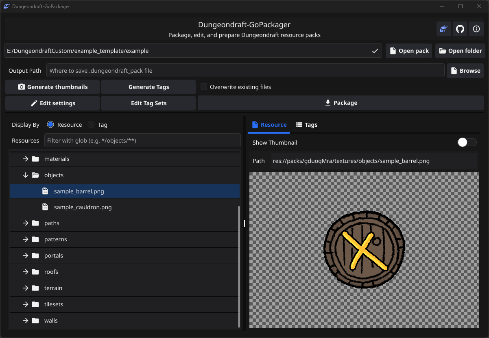
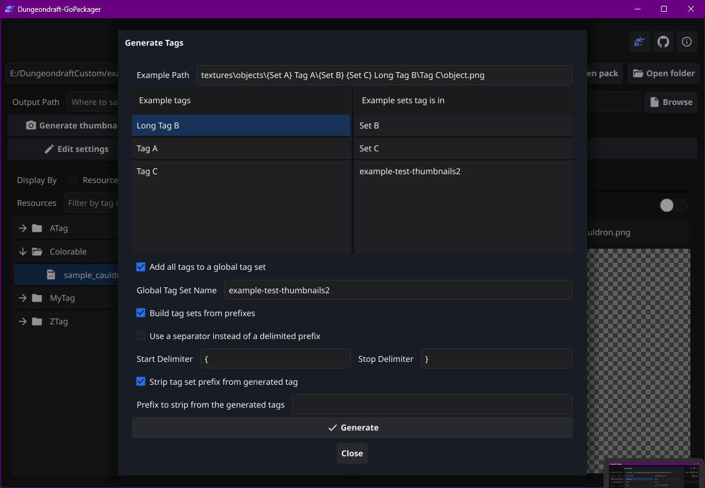

+++
title = 'Version 2 Released'
date = 2024-10-23T19:37:25-07:00
draft = false
+++

DungeonDraft GoPackager version2 is out!

Now edit your resource packages with a shiny new GUI.

- Edit package information,  tag, tag sets, even wall and tileset metadata!
- Generate tags and tag sets from the  folder structure of your package using completely customizable patterns.

<!--more-->

